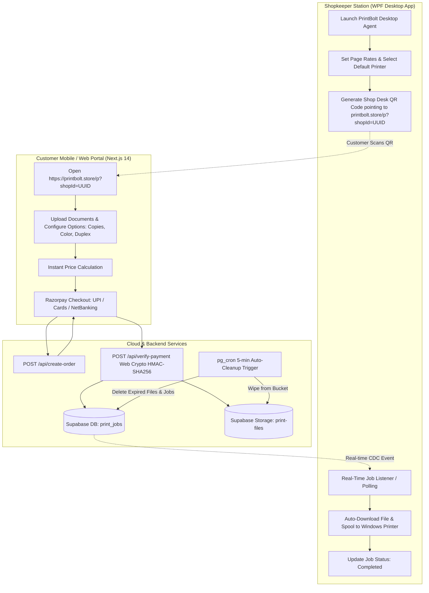

# PrintBolt — Customer Web Portal & Automated Kiosk System

> **Domain:** `https://printbolt.store`  
> **Repository:** `PrintBolt Customer Web Portal` (`customer-web`)  
> **System Architecture:** Cloudflare Edge + Next.js 14 + Supabase + Razorpay + WPF Windows Desktop Agent

---

## 1. Abstract & System Overview

**PrintBolt** (formerly *PrintZap* / *PrintFam*) is a modern, self-service automated document printing kiosk ecosystem. It connects walk-in customers at local xerox and copy centers directly with the shopkeeper's physical printers without manual file handling.

### The Problem It Solves
Traditionally, printing documents at a print shop requires customers to email files, send documents over WhatsApp, or plug in unsecured USB flash drives. Shopkeepers must manually open files, configure print dialogues, calculate per-page prices, collect cash or manual UPI payments, and manage long queues.

### The PrintBolt Solution
1. **Zero-Contact, Zero-Friction:** Customers scan a custom QR code at the shopkeeper's desk.
2. **Instant Web Kiosk:** The browser opens `https://printbolt.store/p?shopId=<UUID>` on the customer's phone without requiring app installation.
3. **Smart Document Configuration:** Customers upload PDF/DOCX/image files, inspect page thumbnails visually, choose color/B&W, duplex/simplex, copy counts, and view real-time price calculations based on the shop's pricing rules.
4. **Seamless Razorpay / UPI Checkout:** Customers pay through integrated UPI/Cards/Netbanking.
5. **Instant Hardware Auto-Print:** The transaction signature is verified on serverless edge routes, and the job is queued in Supabase. The shopkeeper's Windows Desktop Agent automatically downloads the file and spools it directly to the local printer.
6. **Data Privacy & Ephemeral Storage:** Uploaded files and customer records are purged automatically after 5 minutes via database cron routines.

---

## 2. End-to-End Workflow Architecture



---

## 3. Technology Stack Breakdown

### Frontend & Web Kiosk (`customer-web`)
* **Framework:** [Next.js 14](https://nextjs.org/) (App Router, Server-Side Rendering & Edge API Routes)
* **Styling & UI:** [Tailwind CSS](https://tailwindcss.com/), [Lucide React](https://lucide.dev/)
* **Runtime & Hosting:** [Cloudflare Pages](https://pages.cloudflare.com/) running on Cloudflare Workers Edge Network via `@cloudflare/next-on-pages`
* **Custom Domain:** `https://printbolt.store` with Cloudflare SSL/TLS and DNS routing

### Payment Processing
* **Gateway:** [Razorpay](https://razorpay.com/) Standard Web Checkout Modal (`https://checkout.razorpay.com/v1/checkout.js`)
* **Edge Backend Routes:**
  * `POST /api/create-order`: Direct HTTPS call to Razorpay Orders API using native `fetch` (Zero external node-only dependencies).
  * `POST /api/verify-payment`: Cryptographic HMAC-SHA256 signature verification powered by the native **Web Crypto API** (`crypto.subtle`), ensuring full edge compatibility without Node.js `crypto` polyfill issues.

### Backend & Database (BaaS)
* **Database:** [Supabase](https://supabase.com/) (Managed PostgreSQL)
* **Realtime Engine:** Supabase Realtime CDC (Change Data Capture) / REST API for instant job notification.
* **Storage:** Supabase Storage bucket (`print-files`) with ephemeral lifecycle policies.
* **Database Logic & Automation:** PL/pgSQL database functions and cron cleanup (`cleanup_old_print_jobs`) with `storage.allow_delete_query` configuration.

### Desktop Agent (`PrintShopAgent`)
* **Framework:** C# WPF (.NET Framework 4.8 / Windows)
* **Print Engine:** Direct Windows Print Spooler integration via `System.Printing`, `winspool.drv`, and PDF rendering.
* **Features:** Shop registration/login, live printer status polling, queue management, reprint verification, and toggleable floating diagnostics.

---

## 4. Key Directory & File Structure (`customer-web`)

```text
customer-web/
├── app/
│   ├── api/
│   │   ├── create-order/
│   │   │   └── route.ts          # Edge API route to create Razorpay payment orders
│   │   └── verify-payment/
│   │       └── route.ts          # Edge API route for Web Crypto HMAC signature validation
│   ├── p/
│   │   └── page.tsx              # Shop landing route (/p?shopId=UUID) - customer entry point
│   ├── print/
│   │   └── page.tsx              # Document upload & configuration flow
│   ├── status/
│   │   └── page.tsx              # Real-time print job status tracker
│   ├── layout.tsx                # Global HTML metadata, font imports, and layout shell
│   ├── page.tsx                  # Dedicated PrintBolt Homepage & product showcase
│   └── globals.css               # Global Tailwind CSS directives
├── components/
│   ├── AppShell.js               # Header (with shop status badge) and footer wrapper
│   ├── FileUpload.js             # Drag-and-drop file upload & thumbnail renderer
│   ├── PaymentPanel.js           # Razorpay standard modal launcher & payment controller
│   └── PrintOptions.js           # Page range, color, duplex, and copies selector
├── services/
│   └── supabase.js               # Supabase JS client initializer
├── next.config.mjs               # Next.js configuration (Edge & SSR ready)
├── package.json                  # Dependencies & Cloudflare build commands
└── README.md                     # System documentation & AI model context
```

---

## 5. API Endpoints & Contracts

### 1. `POST /api/create-order`
Creates a Razorpay order before launching the customer checkout modal.
* **Runtime:** Edge
* **Request Body:**
  ```json
  {
    "amount": 500,        // Amount in paise (minimum 100 paise = ₹1.00)
    "receipt": "rcpt_123"  // Optional custom receipt identifier
  }
  ```
* **Response (200 OK):**
  ```json
  {
    "order_id": "order_xyz123",
    "amount": 500,
    "currency": "INR"
  }
  ```

### 2. `POST /api/verify-payment`
Validates the cryptographic HMAC-SHA256 signature returned by the Razorpay popup.
* **Runtime:** Edge
* **Request Body:**
  ```json
  {
    "razorpay_order_id": "order_xyz123",
    "razorpay_payment_id": "pay_abc456",
    "razorpay_signature": "e3b0c44298fc1c149afbf4c8996fb92427ae41e4649b934ca495991b7852b855"
  }
  ```
* **Response (200 OK):**
  ```json
  {
    "success": true,
    "message": "Payment verified successfully."
  }
  ```

---

## 6. Environment Variables Reference

Create or configure these in `.env.local` for local development and under **Cloudflare Pages -> Settings -> Variables and secrets** for production:

| Variable Name | Environment | Description | Example |
|---|---|---|---|
| `NEXT_PUBLIC_SUPABASE_URL` | Client & Server | Supabase project URL | `https://xyz.supabase.co` |
| `NEXT_PUBLIC_SUPABASE_ANON_KEY` | Client & Server | Supabase public anonymous key | `eyJhbGci...` |
| `RAZORPAY_KEY_ID` | Server-Only | Razorpay Key ID for backend order creation | `rzp_test_...` / `rzp_live_...` |
| `RAZORPAY_KEY_SECRET` | Server-Only | Razorpay Secret Key for HMAC signature checks | `JhqHI3Qa...` |
| `NEXT_PUBLIC_RAZORPAY_KEY_ID` | Client & Server | Razorpay Publishable Key ID for Checkout script | `rzp_test_...` / `rzp_live_...` |
| `NPM_CONFIG_LEGACY_PEER_DEPS` | Cloudflare Build | Enables legacy peer dependency installation | `true` |

---

## 7. Cloudflare Pages Deployment Guide

1. **Framework Preset:** `None`
2. **Build Command:** `npx @cloudflare/next-on-pages`
3. **Build Output Directory:** `.vercel/output/static`
4. **Environment Variables:** Ensure all keys listed in Section 6 are added under **Settings ➔ Variables and secrets**.

---

## 8. Quick Orientation for AI Agents & Designers

When working on this repository with AI models or tools:
* **Primary Brand Name:** `PrintBolt` (Domain: `printbolt.store`).
* **Design Aesthetic:** Clean, modern, trustworthy, high-contrast UI tailored for fast mobile interactions at busy retail counters.
* **Component Styling:** Use standard Tailwind CSS utility classes; avoid heavy runtime UI frameworks.
* **Edge Compatibility:** Keep all backend routes compatible with the Cloudflare / V8 Edge runtime (use `fetch`, `Web Crypto API`, and standard Web APIs instead of Node-only modules like `fs`, `path`, or Node `crypto`).
